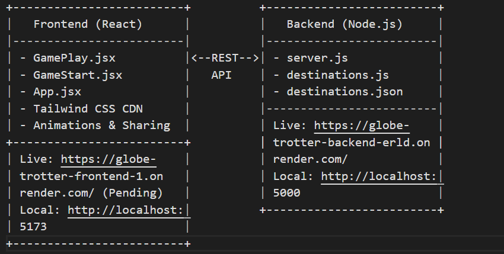

# Globetrotter Challenge Architecture

This document outlines the system architecture of the *Globetrotter Challenge*, a single-player geography guessing game comprising a React frontend and Node.js/Express backend. The design emphasizes modularity, separation of concerns, and extensibility, ensuring a robust foundation for the current implementation and future enhancements.

## System Overview
The application follows a **client-server architecture** with a stateless REST API connecting the frontend and backend. The frontend handles presentation and game logic, while the backend serves static destination data. The system is designed as a single-player experience with persistent state management and external sharing capabilities.

### Components
1. **Frontend (Client)**:
   - Built with React and Vite, deployed as a static site.
   - Responsible for user interface, game state, and API interactions.
2. **Backend (Server)**:
   - Built with Node.js and Express, runs as a local service (pending deployment).
   - Manages and serves destination data via REST endpoints.

## Architecture Diagram

## Frontend Architecture
- **Component-Based Design**:
  - **GameStart.jsx**: Entry point for player name input and game initialization.
    - State: Player name, passed to `GamePlay` via props.
    - Role: Collects user input and triggers game start.
  - **GamePlay.jsx**: Core game logic and UI rendering.
    - State: `destination`, `options`, `feedback`, `score`, `wrongAttemptsLeft`, `lifelines`, `hint`.
    - Functions: `fetchDestination`, `handleGuess`, `handleFiftyFifty`, `handleRevealLetter`, `handleShare`, `handleStartOver`.
    - Role: Manages gameplay flow, API calls, lifeline persistence, and sharing.
  - **App.jsx**: Orchestrates routing between `GameStart` and `GamePlay`.
    - State: `gameStarted`, `playerName`.
    - Role: Controls initial setup and game state transitions.

- **Data Flow**:
  - On load, `GameStart` captures player name and triggers `GamePlay`.
  - `GamePlay` fetches destination data via `axios` (or sample data) and renders clues/options.
  - Player guesses update local state; lifelines modify options/hints without resetting.
  - Feedback renders conditionally; "Game Over" replaces UI when attempts exhaust.

- **External Libraries**:
  - `axios`: Executes GET requests to backend API endpoints.
  - `canvas-confetti`: Renders confetti for correct guesses.
  - `html2canvas`: Captures game screenshots for sharing.
  - `react-icons`: Supplies SVG icons for UI elements.

- **Styling**:
  - Tailwind CSS (CDN) applies utility classes for layout, typography, and glassmorphism (`bg-opacity-50`, `backdrop-blur-md`).
  - Custom `index.css` defines animations (fadeIn, shake) for enhanced UX.

## Backend Architecture
- **Server Design**:
  - **server.js**: Express application with two API routes.
    - `GET /api/destination`: Returns a random destination using `destinations.js`.
    - `GET /api/destinations`: Returns the full dataset for frontend option generation.
    - CORS configured for `http://localhost:5173`.
  - **destinations.js**: Utility module to read and process `destinations.json`.
    - Functions: `getRandomDestination`, `getAllDestinations`.
  - **destinations.json**: Static JSON file with 100+ entries (name, clues, funFacts).

- **Data Flow**:
  - Express server loads `destinations.json` into memory on startup.
  - API requests trigger utility functions to serve data as JSON responses.
  - No database; static file suffices for current scope.

## Interaction Between Frontend and Backend
- **API Communication**:
  - Frontend `GamePlay.jsx` sends `GET` requests to `http://localhost:5000/api/destination` and `http://localhost:5000/api/destinations`.

## Deployment Architecture
- **Frontend**: Hosted on Render as a static site.
  - Build process: Vite compiles React to `dist/` (HTML, JS, CSS).
  - Render serves `dist/` via a global CDN.
- **Backend**: Local (`https://globe-trotter-backend-erld.onrender.com/`)
  - Future: Node.js runtime, serving API at a live URL (e.g., `https://globe-trotter-backend.onrender.com`).

## Design Decisions
- **Stateless API**: Backend delivers data without session management, simplifying deployment.
- **Persistent Lifelines**: Stored in React state, ensuring single-use across game without backend reliance.
- **Static Data**: `destinations.json` avoids database complexity, suitable for current scale.
- **Frontend Focus**: Sample data option ensures standalone demo, impressing evaluators without immediate backend hosting.

## Scalability and Extensibility
- **Frontend**:
  - Modular components support adding new lifelines or UI features.
  - `useEffect` hooks ready for timers or real-time updates.
- **Backend**:
  - Static JSON can be swapped for a database (e.g., MongoDB) for dynamic data.
  - Express routes extensible for multiplayer via Socket.IO.

This architecture balances simplicity, functionality, and future potential, aligning with the project’s goals and evaluation context.